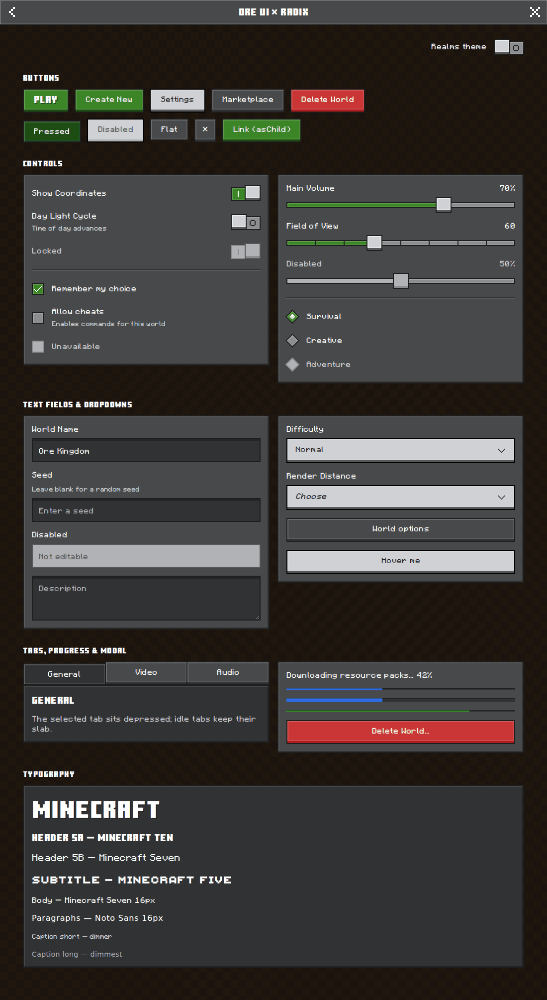

# @eui-components/ore-ui

Minecraft Bedrock **Ore UI** 风格的 React 组件库，基于 [Radix UI](https://www.radix-ui.com/) 无样式原语构建。
A Radix UI extension that reproduces the Minecraft Bedrock Ore UI look.



## 还原方式

样式数值不是凭截图估的，而是从游戏自带的 Ore UI 前端（`data/gui/dist/hbui`）里提取的：

| 来源 | 提取内容 |
| --- | --- |
| `menus-theme.css` | 主题变量：颜色、字体、字号 / 行高、间距，以及每个 pressable 状态对应的 9-slice 贴图参数 |
| `pressable_*.png` 和 `tabBar_*.png`、`listItem_*.png` 等 | 逐像素读取 5×5 / 5×7 贴图：1 texel 深色描边、高光、面色、2 texel 厚度层 |
| `index-*.js` 的 `vanilla` 主题对象 | neutral / neutral20‒100 / primary / secondary / destructive 等角色在 default / hover / pressed / disabled 下的颜色，以及 specular / bevel 叠加色 |
| `index-*.css` | Button、Checkbox、RadioBox、Switch、Slider、TextField、Dropdown、Modal、TabBar、ProgressBar 的尺寸、间距、动画 keyframes 和缓动曲线 |

核心规则：

- **缩放**：Ore UI 设定 `html { font-size: 2.5 × guiScale px }`，100% 时 1rem = 10px，一个贴图 texel = 0.2rem = 2px。本库所有尺寸都从 `--ore-rem` 推导，改这一个变量就等于改游戏里的 UI 缩放。
- **高光**：两层半透明叠加，左上一层、右下一层（primary 默认 `rgba(255,255,255,.2)` / `.1`，hover 时 `.4` / `.3`）。两层交叠的角落像素会自然变亮，和贴图完全一致（在 Chromium 中逐像素比对：`#1e1e1f → #639d52 → #3c8527 → #4f913d → #1d4d13 → #1e1e1f`）。
- **立体感**：按钮底部有 4px 的厚度层（颜色取该角色的 shadow 色）。按下时按钮面下沉 4px、厚度层消失，占位尺寸保持不变。
- **焦点**：紧贴深色描边外侧的 1 texel 白框。
- **动效**：开关使用游戏里的 250ms `step-start` 跳格动画；滑块和进度条使用 `cubic-bezier(0.39, 1.34, 0.66, 1.02)` 回弹曲线。

## 安装

```bash
npm i @eui-components/ore-ui radix-ui react react-dom
```

```tsx
import "@eui-components/ore-ui/styles.css";
import { Button, Switch, Slider } from "@eui-components/ore-ui";

export function Settings() {
  return (
    <div className="ore-theme">
      <Button variant="hero">Play</Button>
      <Switch label="Show Coordinates" defaultChecked />
      <Slider defaultValue={[70]} aria-label="Volume" />
    </div>
  );
}
```

`.ore-theme` 提供基础字体和文字颜色，以及 `box-sizing: border-box`。设计变量定义在 `:root` 上，可以在任意层级覆盖。

### 字体

Ore UI 用到 Minecraft Ten（标题）、Minecraft Seven（UI）、Minecraft Five（副标题）和 Noto Sans（正文）。Mojang 的字体不能再分发，所以本库**不包含**这些字体文件。字体栈已经按游戏里的名称写好，只要在页面里声明对应的 `@font-face`，就会自动生效：

```css
@font-face { font-family: "Minecraft Ten v2"; src: url("/fonts/Minecraft-Ten.otf"); }
@font-face { font-family: "Minecraft Seven v2"; src: url("/fonts/Minecraft-Seven.otf"); }
@font-face { font-family: "Minecraft Five v2"; src: url("/fonts/Minecraft-Five.otf"); }
```

没有这些字体时会回退到 Noto Sans / 系统字体。字体变量为 `--ore-font-heading`、`--ore-font-ui`、`--ore-font-subheading` 和 `--ore-font-body`。

## 组件

| 组件 | Radix 原语 | Ore UI 对应 |
| --- | --- | --- |
| `Button`、`ButtonGroup` | `Slot` | Button：`hero` / `primary` / `secondary` / `neutral` / `destructive`，支持 `elevated`、`pressed`、`size="icon"`、`asChild` |
| `Switch` | `Switch` | Toggle：左右两半分别显示 “I” 和 “O”，凸起的滑块，跳格动画 |
| `Checkbox` | `Checkbox` | Checkbox：12×12 texel |
| `RadioGroup`、`RadioGroupItem` | `RadioGroup` | RadioBox：旋转 45° 的方块，中间是四格宝石 |
| `Slider` | `Slider` | Slider：`showSteps` 显示刻度 |
| `Select*` | `Select` | Dropdown：下拉列表像游戏里一样覆盖在按钮上方展开 |
| `DropdownMenu*` | `DropdownMenu` | 使用 Dropdown 的菜单项样式 |
| `Input`、`Textarea`、`Label`、`Field` | `Label` | TextField：绿色光标，顶部内阴影 |
| `Dialog*` | `Dialog` | Modal：标题栏、深色内容区、带斜面的按钮区 |
| `Tabs*` | `Tabs` | TabBar：未选中的标签凸起，选中的标签按下 |
| `Progress` | `Progress` | ProgressBar：`size="tall"` 为加高版本 |
| `Tooltip*` | `Tooltip` | 游戏菜单里没有 tooltip，这是按 Ore UI 风格延伸设计的 |
| `Panel`、`Separator`、`TitleBar`、`Text`、`PixelIcon` | `Separator` | 面板、分隔线、标题栏、文字排版（header1…captionLong）、像素图标 |

### 主题

```tsx
<div className="ore-theme ore-theme-realms">…</div>  {/* Realms 紫色 primary */}
```

```css
:root { --ore-rem: 12px; }  /* 等同于把游戏 UI 缩放调到 120% */
```

## 开发

```bash
npm install
npm run dev        # 组件演示页 playground（Vite）
npm test           # vitest
npm run typecheck
npm run build      # dist/：ESM + CJS + d.ts + styles.css
```

在 `playground/public/fonts/` 放入自己游戏里的字体文件，演示页就会用真实字体渲染（这些文件已被 gitignore）。

## 参考资料

- [Ore UI – Minecraft Wiki](https://minecraft.wiki/w/Ore_UI)
- [Mojang/ore-ui](https://github.com/Mojang/ore-ui)（React Facet）
- [8Crafter Ore UI Customizer](https://github.com/8Crafter-Studios/8Crafter.github.io)：其中收录了游戏 `hbui` 构建产物的镜像，用于提取上述数值
- [OreUI-Viewer](https://github.com/xKingDark/OreUI-Viewer)

本项目与 Mojang / Microsoft 无关。Minecraft 是 Mojang Synergies AB 的商标。
